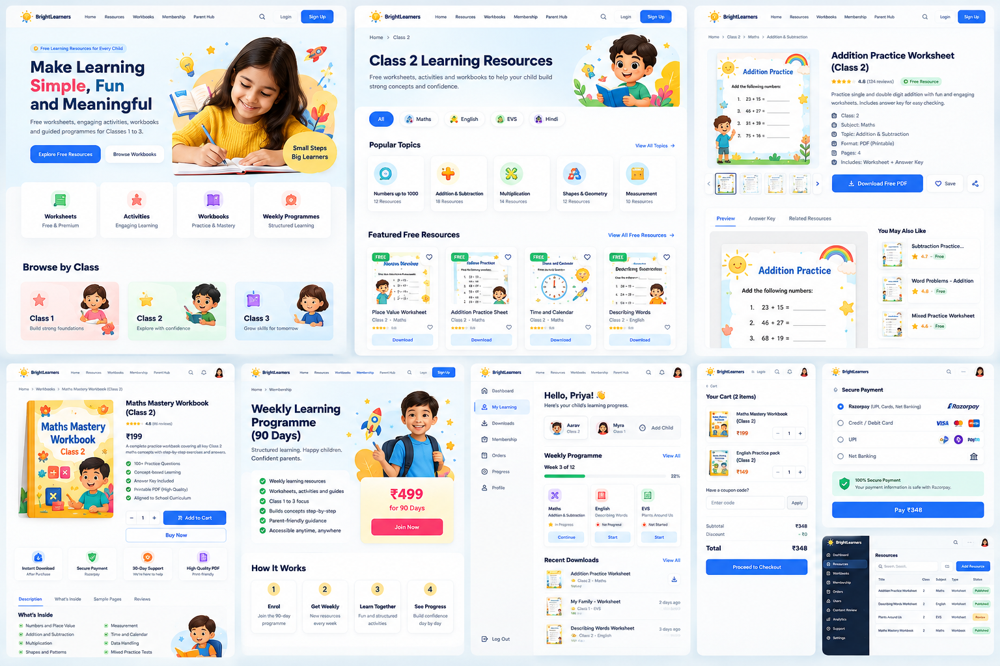

# Design reference

What the mockup shows, where each screen is built, and where the mockup and the plan disagree.

Mockup: [../design/ui-mockup.png](../design/ui-mockup.png)

The mockup is a single image with nine screens. It is a direction for look and layout, not a specification. Where it conflicts with the source plan, the plan wins unless a decision in [../tracking/decisions.md](../tracking/decisions.md) says otherwise.

## Visual language

Values below are read from the image by eye. Replace them with exact values from the design source file when it is available.

| Token | Approximate value | Used for |
|---|---|---|
| Primary | blue, about `#2563EB` | Primary buttons, links, active nav, "Fun" in the hero |
| Ink | dark navy, about `#0F172A` | Headings and body text |
| Accent warm | coral red, about `#EF4444` | "Simple," in the hero, price on the workbook page |
| Accent action | pink-red, about `#F43F5E` | "Join Now" on the membership page |
| Highlight | yellow, about `#FBBF24` | Badges, stars, the "Small Steps Big Learners" sticker |
| Success | green, about `#22C55E` | "FREE" tags, check-mark bullets, "Free Resource" badge |
| Surface | white cards on a very light blue / cream background | Page background and cards |

- Typeface: a rounded geometric sans-serif, close to Poppins. The repo currently loads Instrument Sans in `vite.config.js`; change it when the brand font is confirmed (Phase 0 brand basics).
- Shape: large rounded corners on cards and buttons, soft shadows, generous white space.
- Illustration: friendly cartoon children and school objects. These are assets to be supplied; do not use the mockup's images in production without the rights to them.

Define the colours once as Tailwind theme variables in `resources/css/app.css` and use the token names in components.

## Screens

### 1. Home — `/` — Phase 5

- Header: logo, Home, Resources, Workbooks, Membership, Parent Hub, search, Login, Sign Up.
- Hero: "Make Learning Simple, Fun and Meaningful", one line of supporting copy, two buttons: Explore Free Resources, Browse Workbooks.
- Four category cards: Worksheets (Free & Premium), Activities (Engaging Learning), Workbooks (Practice & Mastery), Weekly Programmes (Structured Learning).
- Browse by Class: Class 1, Class 2, Class 3 cards.

Build notes: class cards come from the `classes` table. The category cards link to `/free` filtered by type, `/shop` and `/membership`.

### 2. Class page — `/class-2` — Phase 5

- Breadcrumb: Home › Class 2.
- Title "Class 2 Learning Resources" with a short description.
- Subject chips: All, Maths, English, EVS, Hindi.
- Popular Topics: cards with a resource count.
- Featured Free Resources: cards with a FREE tag, title, class and subject, rating, Download.

Build notes: chips come from `class_subject`. Topic counts are real counts of published resources. Featured uses `resources.featured`.

### 3. Free resource — `/free/class-2/maths/addition-practice-worksheet` — Phase 5

- Breadcrumb: Home › Class 2 › Maths › Addition & Subtraction.
- Preview image with thumbnails.
- Title, "Free Resource" badge, short description.
- Facts: Class, Subject, Topic, Format (PDF, printable), Pages, Includes (Worksheet + Answer Key).
- Download Free PDF, Save, Share.
- Tabs: Preview, Answer Key, Related Resources.
- Side list: You May Also Like.

Build notes: add the fields the plan requires and the mockup omits — learning objective, estimated time, supplies, print mode.

### 4. Product — `/shop/class-2/maths-mastery-workbook` — Phase 6

- Cover, title, rating, price ₹199, short description.
- Check-mark bullets.
- Quantity stepper, Add to Cart, Buy Now.
- Trust row: Instant Download, Secure Payment, 30-Day Support, High Quality PDF.
- Tabs: Description, What's Inside, Sample Pages, Reviews.

Build notes: "What's Inside" is generated from the included resources and their skills. Sample pages are real `resource_previews`.

### 5. Membership — `/membership` — Phase 10

- Title "Weekly Learning Programme (90 Days)", tagline, benefit bullets.
- Price card: ₹499 for 90 Days, Join Now.
- How It Works: Enrol → Get Weekly → Learn Together → See Progress.

Build notes: add what the plan requires — exclusions, what happens at the end, no automatic renewal, a link to the sample month.

### 6. Parent dashboard — `/account/dashboard` — Phase 11

- Sidebar: Dashboard, My Learning, Downloads, Membership, Orders, Progress, Profile, Log Out.
- Greeting, child chips with class, Add Child.
- Weekly Programme: "Week 3 of 12", a progress bar, one card per subject with status and a Continue / Start button.
- Recent Downloads.

### 7. Cart — `/cart` — Phase 7

- Line items with cover, name, price.
- Coupon field.
- Subtotal, Discount, Total, Proceed to Checkout.

### 8. Payment — `/checkout` — Phase 7 and 8

- A list of payment methods, a "100% Secure Payment" note, Pay ₹348.

### 9. Admin — `/admin` — Phase 1 onwards, finished in Phase 14

- Dark sidebar: Dashboard, Resources, Workbooks, Membership, Orders, Users, Content Review, Analytics, Support, Settings.
- Resources table: Title, Class, Subject, Type, Status; search; Add Resource.

## Where the mockup and the plan disagree

Each row is an open item in [../tracking/decisions.md](../tracking/decisions.md). Until it is decided, build the "Default" column.

| ID | Mockup shows | Plan says | Default |
|---|---|---|---|
| M-01 | A Hindi subject chip | Launch subjects are Maths, English, EVS / mixed | Do not seed Hindi. Chips come from data, so adding it later needs no code. |
| M-02 | Star ratings, review counts, a Reviews tab, Save / heart | Reviews and favourites are deferred to Phase 17, "if evidence supports them" | Leave them out. Never show invented ratings. |
| M-03 | A payment-method picker on our page | Razorpay Checkout handles method choice | One "Pay ₹…" button that opens Razorpay |
| M-04 | A "30-Day Support" badge | Support terms are a policy decision | Leave it out until the policy is approved |
| M-05 | Quantity steppers on product and cart | Digital products for household use | Quantity is always 1. No stepper. |
| M-06 | "Aligned to School Curriculum" | No standards-compliance claims (Phase 3) | Use wording the teacher reviewer approves |
| M-07 | A custom dark admin | Admin is Filament | A Filament theme with a dark sidebar |
| M-08 | A progress bar with a percentage | Completion is engagement, not mastery | Label it "activities opened / completed" |

## Components to build once

Build these in Phase 5 and reuse them later.

| Component | First used | Reused in |
|---|---|---|
| `SiteHeader`, `SiteFooter`, `PublicLayout` | 5 | 6, 10, 12 |
| `Breadcrumbs` | 5 | 6, 12 |
| `ClassCard`, `TopicCard`, `SubjectChips` | 5 | 6 |
| `ResourceCard` | 5 | 9, 11 |
| `PreviewCarousel` | 5 | 6 |
| `MetaList` (the facts list) | 5 | 6 |
| `EmptyState`, `Pagination` | 5 | everywhere |
| `ProductCard`, `PriceTag` | 6 | 7 |
| `AccountLayout` (sidebar) | 9 | 10, 11 |
| `Seo`, `JsonLd` | 12 | all public pages |

## Rules for every public page

- Works at phone width first.
- Has one `<h1>`.
- Images have width, height and alt text.
- Nothing that matters for search depends on JavaScript having run.
